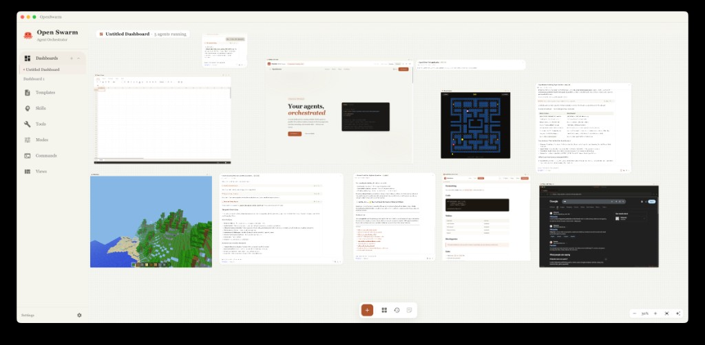

<p align="center">
  
</p>

<h1 align="center">Open Swarm</h1>

<p align="center">
  <strong>An Army of AI Agents at Your Fingertips</strong>
  <br>
  A locally-running orchestrator for managing multiple agents in parallel.
  <br>
  Launch, monitor, and coordinate entire swarms of coding agents from a single interface.
</p>

<p align="center">
  <a href="LICENSE"></a>
  <a href="#"></a>
  <a href="https://github.com/openswarm-ai/openswarm/stargazers"></a>
  <a href="https://github.com/openswarm-ai/openswarm/pulls"></a>
</p>

<br>

<p align="center">
  
</p>

<br>

## Why Open Swarm?

Running agents in a terminal works fine for one task. But when you're juggling five agents across different branches, approving tool calls in separate windows, and losing track of who's doing what — it falls apart fast.

- **Parallel agents, one screen** — Launch as many agents as you need, arranged on a spatial canvas you can pan and zoom freely
- **Unified approval workflow** — Every tool-use request from every agent surfaces in one place. Approve or deny with a click or a keyboard shortcut.
- **Full conversation control** — Edit prior messages to fork conversations, navigate between branches, resume closed sessions
- **100% local** — Everything runs on your machine. No cloud relay, no telemetry, no third-party backend.

<br>

## Features

**Spatial Dashboard** — Infinite canvas with drag-and-drop agent cards, view cards, and embedded browser cards. Create multiple dashboards for different workspaces.

**Agent Chat** — Full streaming chat interface powered by WebSockets. Real-time token output, cost tracking per session, and persistent history that survives restarts.

**Human-in-the-Loop Approvals** — Agents request permission before executing tools. Approve or deny individually, or batch-approve from the dashboard. Configurable per-tool permissions (always allow, ask, deny).

**Message Branching** — Edit any prior message to fork the conversation. Navigate freely between branches without losing context.

**Prompt Templates** — Build reusable templates with structured input fields. Invoke them inline via `/` slash commands.

**Skills Library** — Manage skills that sync directly to `~/.claude/skills/`. Browse and install from the official Anthropic skills marketplace.

**Tools Library** — Configure MCP tool servers (stdio, HTTP, SSE) with automatic tool discovery. Browse the MCP registry and Google's catalog with GitHub star counts. Includes Google Workspace OAuth integration.

**Agent Modes** — Five built-in modes (Agent, Ask, Plan, View Builder, Skill Builder) plus custom user-defined modes with configurable system prompts and tool restrictions.

**Views & Outputs** — Create interactive HTML/JS/CSS artifacts rendered in iframes. Supports vibe coding (LLM-generates the view), backend Python execution, auto-run with LLM-generated data, and agent-driven data gathering.

**Git Worktree Isolation** — Each agent operates in its own git worktree and branch, preventing conflicts between parallel workstreams.

**Diff Viewer** — Inspect uncommitted changes in any agent's worktree without leaving the app.

**Cost Tracking** — Real-time USD spend tracking per agent session.

**Dark & Light Themes** — Full theme support with design tokens.

**Keyboard Shortcuts** — Navigate between agents, approve/deny requests, and switch pages without touching a mouse.

<br>

## Quick Start

### Desktop App

Download the latest release for macOS from [GitHub Releases](https://github.com/openswarm-ai/openswarm/releases).

> Windows and Linux builds are planned but not yet available.

### Development Setup

**Prerequisites:** Python 3.11+, Node.js 18+, Git

```bash
git clone https://github.com/openswarm-ai/openswarm.git
cd openswarm
bash run/local.sh
```

This starts the backend (port 8324), frontend (port 3000), and Electron shell together. Once running, set your Anthropic API key in the in-app Settings page.

To run services individually:

```bash
bash backend/run.sh     # API at http://localhost:8324 — docs at /docs
bash frontend/run.sh    # App at http://localhost:3000
```

<br>

## Architecture

```
Electron Shell (desktop wrapper, auto-updater)
├─────────────────────────────────────────────────────────────────────┐
│                                                                     │
│   Frontend (React/TypeScript :3000)       Backend (FastAPI :8324)   │
│   ┌───────────────────────────────┐      ┌───────────────────────┐  │
│   │  Spatial Dashboard Canvas     │◄────►│  REST API  (/api/*)   │  │
│   │  Agent Chat (streaming)       │      │  WebSocket (/ws/*)    │  │
│   │  Templates / Skills / Tools   │ WS   │  Agent Manager        │  │
│   │  Modes / Views / Commands     │◄────►│    └─ claude-agent-sdk│  │
│   │  Settings                     │      │  MCP Tool Discovery   │  │
│   │  Redux Toolkit (state)        │      │  JSON File Storage    │  │
│   └───────────────────────────────┘      └───────────────────────┘  │
│                                                                     │
└─────────────────────────────────────────────────────────────────────┘
```

<br>

## Configuration

The Anthropic API key is configured in-app via the **Settings** page — no environment variable needed for normal usage.

For advanced configuration, copy `backend/.env.example` to `backend/.env`:

| Variable | Purpose |
|----------|---------|
| `BACKEND_PORT` | Backend server port (default: `8324`) |
| `GOOGLE_OAUTH_CLIENT_ID` | Google Workspace integration (Gmail, Calendar, Drive) |
| `GOOGLE_OAUTH_CLIENT_SECRET` | Google Workspace integration |
| `APPLE_ID` | macOS code signing & notarization (release builds only) |
| `APPLE_APP_SPECIFIC_PASSWORD` | macOS notarization (release builds only) |
| `APPLE_TEAM_ID` | macOS code signing (release builds only) |
| `GH_TOKEN` | GitHub Releases publishing (release builds only) |

<br>

## Keyboard Shortcuts

| Key | Action |
|-----|--------|
| `D` | Go to Dashboard |
| `T` | Go to Templates |
| `1` – `9` | Open agent by position |
| `Shift+A` | Approve all pending requests |
| `Shift+D` | Deny all pending requests |
| `?` | Show shortcuts help |

Type `/` in the chat input to invoke prompt templates and skills as slash commands.

<br>

## Project Structure

```
backend/
  apps/
    agents/           Agent lifecycle, streaming, worktree management
    dashboards/       Dashboard CRUD and layout persistence
    dashboard_layout/ Card positions and spatial canvas state
    templates/        Prompt template CRUD
    skills/           Skills CRUD (synced to ~/.claude/skills/)
    tools_lib/        MCP tool configuration and discovery
    modes/            Agent mode definitions
    outputs/          Views/outputs, vibe coding, Python executor
    settings/         App settings and file browser
    health/           Health check endpoint
    mcp_registry/     MCP server registry proxy
    skill_registry/   Anthropic skills marketplace proxy
  config/             FastAPI app configuration
  data/               Persistent JSON file storage

frontend/
  src/
    app/
      components/     AppShell, Layout, shared UI
      pages/
        Dashboard/    Spatial canvas with agent/view/browser cards
        AgentChat/    Streaming chat, HITL approvals, branching, diff viewer
        Templates/    Template library with structured input fields
        Skills/       Skills library, skill builder, registry browser
        Tools/        Tool config, MCP discovery, OAuth, registry browser
        Modes/        Mode definitions with system prompts
        Views/        Output artifacts, code editor, vibe coding
        Commands/     Keyboard shortcuts reference
        Settings/     App configuration
    shared/
      state/          Redux slices (agents, dashboards, templates, skills, tools, modes, etc.)
      ws/             WebSocket manager
      hooks/          Custom hooks
      styles/         Theme tokens, global styles

electron/
  main.js             Electron main process, auto-updater, Python env management
  scripts/            Build and notarization scripts

run/
  utils/
    build-app.sh        Desktop app packaging (electron-builder)
    build-python-env.sh Standalone Python 3.13 environment bundler
  local.sh           Start backend, frontend, and Electron shell
  publish.sh         Build and deploy to Firebase Hosting
```

<br>

## Tech Stack

**Frontend** — React 18, TypeScript, Redux Toolkit, Material UI v7, CodeMirror 6, Framer Motion, React Router v7, Webpack 5

**Backend** — FastAPI, Python 3.11+, Pydantic v2, claude-agent-sdk, Anthropic SDK, WebSockets, httpx

**Desktop** — Electron 33, electron-builder, electron-updater (auto-updates via GitHub Releases)

**Bundled Runtime** — Standalone Python 3.13 (via python-build-standalone) so end users don't need Python installed

<br>

## Contributing

Contributions are welcome. To get started:

1. Fork the repository
2. Create a feature branch (`git checkout -b feature/your-feature`)
3. Make your changes
4. Submit a pull request

Please open an issue first for larger changes so we can discuss the approach.

<br>

## License

MIT — see [LICENSE](LICENSE) for details.
